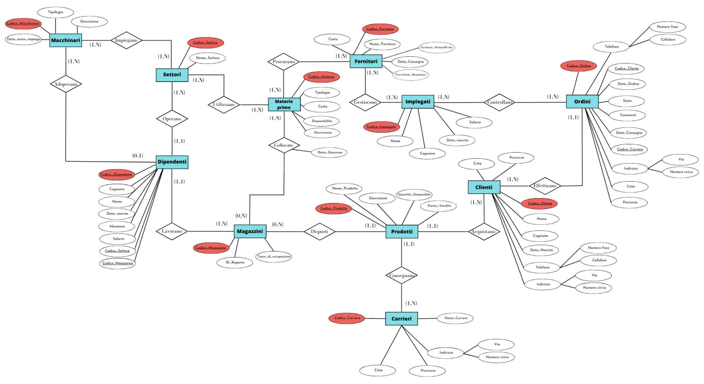

# Futura S.p.A. — Database Design Project

This project was developed as part of the **Databases (Module B)** course in the *Artificial Intelligence & Data Analytics* program at the University of Trieste.

## 📘 Project Overview

The goal of the project was to design and implement a relational database for a fictional company — **Futura S.p.A.**, a simulated IT business that sells tech products. From the initial concept to the final SQL implementation, **every stage of the project was carried out independently**.

The design process followed classical database development methodology:
- Conceptual modeling using an Entity-Relationship (ER) diagram
- Logical schema creation
- Physical schema implementation in SQL
- Sample SQL queries for real-life scenarios

## 📁 Project Structure

```
Futura_SQL_Project/
├── Futura.sql
├── Futura_DataBase.pdf
├── RelationshipEntity_diagram_Futura.png
├── README.md
```

- `Futura.sql`: SQL script with `CREATE TABLE`, `INSERT`, and example queries.
- `Futura_DataBase.pdf`: Complete project report with ER diagrams, constraints, volumes, and data dictionary.
- `RelationshipEntity_diagram_Futura.png`: Conceptual ER diagram used for database design.
- `README.md`: This Markdown documentation file.

## 🧠 Entity-Relationship Diagram

The following diagram represents the conceptual model that guided the database structure:



## ⚙️ Technologies Used

- SQL (PostgreSQL-compatible)
- Manual ER modeling
- PDF documentation
- No frameworks or code generators used — the project was entirely developed manually

## 👤 Author

**Tommaso Mingrone**  
Artificial Intelligence & Data Analytics  
University of Trieste

---

> **Disclaimer:** *Futura S.p.A. is a fictional company. However, the design and development of this database are 100% original and fully self-directed.*

